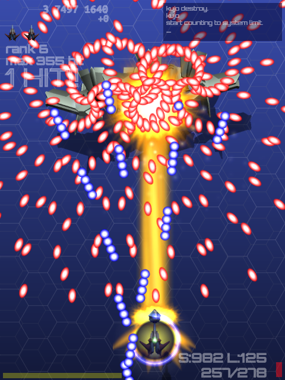

# TM-Shooter
## 2D DANMAKU Shooter on tmlib.js

HTML5弾幕STG、GL-Shooterシリーズの２作目です。

http://tmshooter.net/ (Google Chrome専用)

## 操作方法

 * カーソルキー ... 移動
 * Cキーを連打 ... ショット
 * Cキーを押しっぱなし ... レーザー
 * Xキー ... ボンバー or ハイパーシステム起動
 * Zキー ... ショットをフルオート発射

## コンセプト

コンセプトは「tmlib.jsによる怒首領蜂再現」。

具体的には

 * tmlib.js + bulletml.jsのみで作る
 * 空中物・地上物の区別
 * 早回し・遅回し
 * ショットとレーザーを撃ちわけ
 * ボム・オートボム・ハイパーシステム・大型機撃破時の弾消し
 * GPS(ゲットポイントシステム)
 * 自機・スタイル選択
 * 鬼畜難度

こんな感じかな？

このゲームの開発を通じてtmlib.jsへの機能追加や不具合解消に貢献できたら幸いです。

## ゲーム素材の再利用について

本アプリケーション素材の再利用条件は以下のとおりです。

### JavaScriptおよびHTMLファイル

著作権はdaishihmr(daishi.hmr(at)gmail.com)に帰属します。

jsファイル、およびhtmlファイルはすべてMITライセンスのもとで再利用可能です。

詳細な著作権情報については、個々のファイル内のライセンス表記を参照ください。

### 画像素材

以下の画像ファイルはdaishihmrとProjectTeam DoGA様の共同著作物となります。
非営利目的での再利用が可能です。詳細は以下のURLを参照ください。

http://doga.jp/2010/programs/dogal/dogal3/license.html

 * assets/fighters.png
 * assets/tex1.png
 * assets/tex_stage1.png
 * assets/tex/tank1.png
 * assets/rawディレクトリ内のpngファイル
 * assets/raw/l3pディレクトリ以下の全ファイル

その他のassetsディレクトリ内画像ファイルはdaishihmrの著作物です。

MITライセンスのもとで再利用可能です。

### 音声素材

assets2ディレクトリ内の音声ファイルの利用条件については、assets2/COPYRIGHTを参照し、個々の素材ごとの利用条件に従ってください。

### フォント素材

fontディレクトリ内のフォントファイルの利用条件については、以下のtxtファイルを参照ください。

 * Orbitron-Regular.ttf
  * OFL.txt
 * UbuntuMono-Bold.ttf
  * UFL.txt

### その他

「怒首領蜂」は株式会社ケイブ様の登録商標です。
